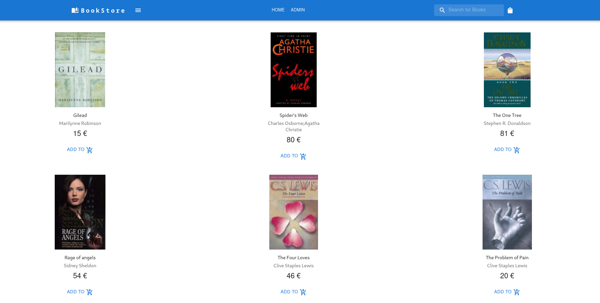
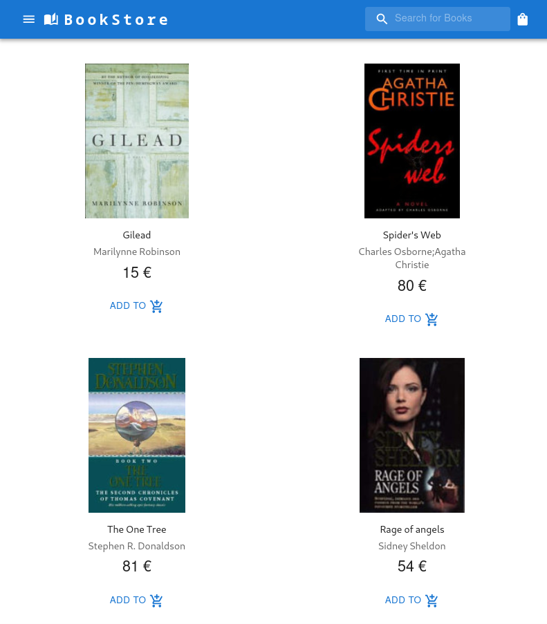
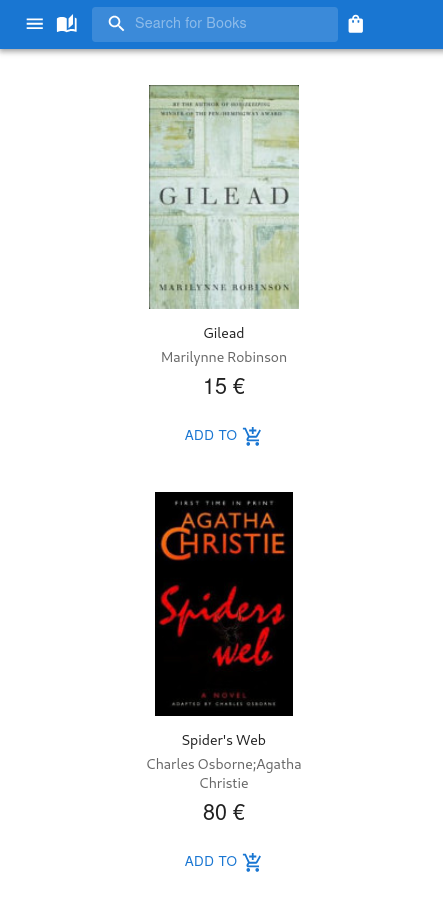

# BookStore
A simple bookstore application written in ASP.NET.
 
For easy testing the database being used is SQLite (books.db file).
 
This repository contains the backend of the app.
For the frontend click [here](https://github.com/DimMil24/BookStoreClient)
 

##  Features
- Responsive Design
- JWT Authentication
- Field Validation
- Search with filters
- Group By Category
- Admin Book Management

## Admin Page
Books can be added, edited and deleted.

## Responsive Design

### Large ViewPort

### Medium ViewPort

### Small ViewPort

